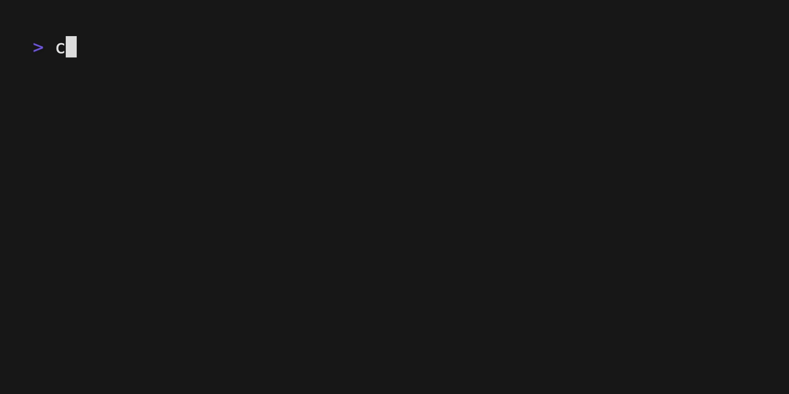

# memo-rs

Do you often forget that one command you use daily, or find yourself running long sequences of commands repeatedly? **memo-rs** is here to make your life easier

**memo-rs** (pronounced as _memories_) is a terminal application designed to serve as your personal command database. It not only stores commands with detailed explanations but also allows you to copy them to your clipboard effortlessly.



## Usage

**memo-rs is still in its early stages of development**. You can compile and use it, but the experience may not be as good as it will be in future versions

If you want to give it a try, just follow these steps 

```bash
git clone git@github.com:apereiroc/memo-rs.git
cd memo-rs
cargo run -- --filename examples/demo.json
```
